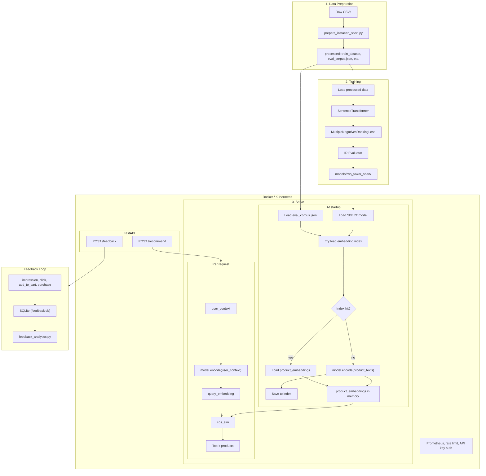

# Instacart Next-Order Recommendation

This project ranks products by likelihood of appearing in a user's next order. I built a two-tower Sentence-BERT model on the [Instacart dataset](https://www.kaggle.com/c/instacart-market-basket-analysis) (one tower for user context, one for product text), an end-to-end pipeline (data prep → train → serve), a FastAPI service with `/recommend` and `/feedback` endpoints, baselines (content-based SBERT, item-item CF), a feedback loop (SQLite storage, `feedback_analytics.py` for CTR/funnel metrics, `generate_sample_feedback.py` for sample data), production features (Prometheus, rate limiting, API key auth, Docker, MPS for Apple Silicon), and scripts to compare untrained vs trained and check for embedding collapse.

See the the two blog posts for a deeper walkthrough [Medium Blog 1](https://medium.com/@bowenchen/from-purchase-history-to-recommendations-a-two-tower-approach-to-rank-products-c624d8a6c024), [Medium Blog 2](https://medium.com/@bowenchen/from-two-tower-model-training-to-production-deployment-monitoring-and-beyond-6dc0bba9de50)

**Contents:** [What we are predicting](#what-we-are-predicting) · [Requirements](#requirements) · [Setup](#setup) · [How to use each component](#how-to-use-each-component) · [Pipeline](#pipeline) · [Results](#results) · [API](#api) · [Docker](#docker) · [Kubernetes](#kubernetes) · [Project structure](#project-structure)

---

## Prediction Problem

- **Task:** Rank the catalog so products in the user’s _next_ order are at the top (see **What we are predicting** above).
- **Input:** User context from _prior_ orders only: a single text string built from the last N prior orders (product names in sequence, optional timing like “ordered 7 days after previous on weekday 4 at hour 14”). No information from the “next” order is included at prediction time.
- **Output:** A ranking over the full product catalog: each product gets a score (cosine similarity between the encoded context and the encoded product text). We return the top-k product IDs (and optionally scores).
- **Train vs serve:** For **training**, each (anchor, positive) pair has anchor = prior-only context (and during data prep we can optionally include “Next: weekday X, hour Y, …” in the anchor for that target order). The **positive** is one product that actually appears in that order’s next basket. For **serve and evaluation**, the query is the _same_ prior-only context **without** the “Next: …” segment, so we never use future information and the setup matches production.

---

### Overall Architecture



---

## How this model could be used later

- **In-app “reorder” or “buy again”:** Surface a short list of products (“You might need these”) on the home screen or before checkout, ordered by the model’s scores. Users can one-tap add items they regularly buy.
- **Email / push:** Trigger “Your usual items are back” or “Restock these?” campaigns using top-k recommendations per user, optionally filtered by category or recency.
- **Cold start:** For users with few or no prior orders, the context can be minimal (e.g. first order only); the same pipeline still returns a ranking. You can combine with non-personalized fallbacks (trending, category) when context is too weak. (In this project, we don't have rich user features hence this doesn't work very well)
- **APIs and services:** Expose the recommender as a service: input = user context string (or user_id + lookup from your DB), output = top-k product IDs and scores. Other teams (search, ads, merchandising) can call it to personalize surfaces.
- **Batch precompute:** Precompute top-k per user on a schedule (e.g. nightly), store in a key-value store or feature store, and serve from cache for low-latency UX while retraining the model periodically.
- **A/B testing:** Run the two-tower model as one arm (e.g. “SBERT next-order”) vs rule-based or other models, and measure impact on add-to-cart, order size, or repeat purchase.

---

## Requirements

- **Python** 3.10+ (3.12 recommended; managed via `uv` or your environment).
- **Instacart dataset** from [Kaggle](https://www.kaggle.com/c/instacart-market-basket-analysis/data) (orders, order_products, products, aisles, departments). Download and place CSVs under `data/`.
- **Disk:** ~2–3 GB for raw data + processed datasets; model checkpoints add a few hundred MB per run.
- **Memory:** 8 GB RAM is enough for data prep and inference; training benefits from 16 GB+ and a GPU (CUDA or Apple MPS) for speed.

---

## Setup

1. **Clone or open the repo** and enter the project root.
2. **Install dependencies** (prefer `uv` for a locked environment):

```bash
 uv sync
```

Or with pip: `pip install -e .` (see `pyproject.toml` for dependencies).

3. **Download the Instacart data** from Kaggle into `data/`. You need at least:

- `orders.csv`
- `order_products__prior.csv`
- `products.csv`
- `aisles.csv`
- `departments.csv`

4. **Optional:** Create a `.env` file in the project root with `HF_TOKEN=...` if you use private Hugging Face models or datasets.
5. **Verify:** Run data prep (see Pipeline below); it will fail with a clear error if any CSV is missing or misnamed.

---

## How to use each component

| Component                        | Command / Usage                                                                                      | When to use                                                                               |
| -------------------------------- | ---------------------------------------------------------------------------------------------------- | ----------------------------------------------------------------------------------------- |
| **Data prep**                    | `uv run python -m src.data.prepare_instacart_sbert`                                                  | First step: build train/eval datasets from raw CSVs                                       |
| **Train**                        | `uv run python -m src.training`                                                                      | Train the two-tower SBERT model (configs/train.yaml)                                      |
| **CLI inference**                | `uv run python -m src.inference --top-k 10`                                                          | One-off recommendations from command line                                                 |
| **HTTP API**                     | `uv run uvicorn src.api.main:app --port 8000`                                                        | Serve recommendations as a REST API                                                       |
| **Baselines**                    | `uv run python -m src.baselines --processed-dir processed/p5_mp20_ef0.1`                             | Compare SBERT vs content-based and CF                                                     |
| **Compare untrained vs trained** | `uv run python scripts/compare_untrained_vs_trained.py`                                              | Check for embedding collapse; compare metrics                                             |
| **Feedback analytics**           | `uv run python scripts/feedback_analytics.py`                                                        | CTR, add-to-cart rate, purchase rate from feedback                                        |
| **Generate sample feedback**     | `uv run python scripts/generate_sample_feedback.py`                                                  | Send recommend + feedback requests to API (run feedback_analytics separately for reports) |
| **Upload model to HF**           | `uv run python scripts/upload_model_to_hf.py --repo-id USER/instacart-two-tower-sbert`               | Upload trained model to Hugging Face Hub (set repo_id in configs/upload_model.yaml or --repo-id) |
| **Upload corpus to HF**         | `uv run python scripts/upload_corpus_to_hf.py --repo-id USER/instacart-eval-corpus`                 | Upload eval_corpus.json to Hugging Face (dataset repo by default; use --repo-type model to add to model repo) |
| **API tests**                    | `uv run pytest tests/ -v`                                                                            | Run API tests (mocked recommender)                                                        |
| **Docker**                       | `docker build -t instacart-rec-api .` then `docker run -p 8000:8000 -v ...` (see [API](#api) Docker) | Containerized deployment                                                                  |

**Typical workflow:** 1) Prepare → 2) Train → 3) Serve (CLI or API) → 4) Collect feedback via API → 5) Run feedback analytics.

---

## Data

### Input files (under `data/`)

| File                        | Key columns                                                                                         | Role                                                                                                                          |
| --------------------------- | --------------------------------------------------------------------------------------------------- | ----------------------------------------------------------------------------------------------------------------------------- |
| **orders.csv**              | order_id, user_id, **eval_set**, order_number, order_dow, order_hour_of_day, days_since_prior_order | `eval_set == "train"` → target “next” orders we predict for; `eval_set == "prior"` → history used to build user context only. |
| **order_products__prior.csv** | order_id, product_id                                                                                | Which products are in each prior order; used to build (anchor, positive) pairs.                                               |
| **products.csv**            | product_id, product_name, aisle_id, department_id                                                   | Product names and hierarchy.                                                                                                  |
| **aisles.csv**              | aisle_id, aisle                                                                                     | Aisle names for product text.                                                                                                 |
| **departments.csv**         | department_id, department                                                                           | Department names for product text.                                                                                            |

No `order_products__train.csv` is required for this pipeline: we only use prior orders for context and the train-set orders to define _which_ next order we are predicting (and to split train/eval by order).

### Data prep output (processed/)

Data prep writes under a **param-based subdir** of `processed/`, e.g. `processed/p5_mp20_ef0.1/`, so different runs (e.g. different `max_prior_orders` or `eval_frac`) do not overwrite each other. The subdir name encodes: `p` = max_prior_orders, `mp` = max_product_names, `ef` = eval_frac (and optionally `sf` = sample_frac, `no_serve` if eval queries keep “Next: …”).

| Output                      | Description                                                                                                                            |
| --------------------------- | -------------------------------------------------------------------------------------------------------------------------------------- |
| **train_dataset/**          | Hugging Face Dataset on disk: columns `anchor`, `positive`. Each row is one (user context, product from next order) pair for training. |
| **eval_dataset/**           | Same format; used for validation loss (optional).                                                                                      |
| **eval_queries.json**       | Map from query_id (order_id as string) to the **serve-time** user context string (no “Next: …” when `eval_serve_time=True`).           |
| **eval_corpus.json**        | Map from product_id (string) to product text (`"Product: X. Aisle: Y. Department: Z."`).                                               |
| **eval_relevant_docs.json** | Map from query_id to list of product_ids that are in that order’s next basket (relevance labels for IR metrics).                       |
| **data_prep_params.json**   | Record of the data prep arguments and counts (n_train_pairs, n_eval_queries, n_corpus, etc.).                                          |

---

## Pipeline

### 1. Prepare

Reads the CSVs, builds one **anchor** (user context string) per target order, and for each product in that order’s “next” basket creates a **(anchor, positive)** pair with **positive** = product text. Splits orders into train vs eval (by order, not by pair), and writes the train/eval Datasets plus `eval_queries.json`, `eval_corpus.json`, `eval_relevant_docs.json` for the Information Retrieval evaluator.

**Config:** Edit `config/data_prep.yaml` for `max_prior_orders`, `max_product_names`, `eval_frac`, `data_dir`, `output_dir`, etc. Override with `--config path/to/config.yaml`. At the end the script prints the exact `--processed-dir` to use for training.

### 2. Train

Loads the processed dir (auto-resolves to a single param subdir under `processed/` if the default path has no `train_dataset`), builds a Sentence Transformer bi-encoder (default base: `all-MiniLM-L6-v2`), and trains with **MultipleNegativesRankingLoss** (in-batch negatives). Optionally runs **InformationRetrievalEvaluator** each epoch (Accuracy@k, MRR@10, NDCG@10, MAP@100). Saves checkpoints under `models/two_tower_sbert/` and, when IR eval is on, keeps the best by NDCG@10 in `models/two_tower_sbert/final/`.

**Config:** Edit `configs/train.yaml` for `processed_dir`, `output_dir`, `learning_rate`, `epochs`, etc. Override with `--config path/to/config.yaml`.

### 3. Serve (via CLI or FastAPI)

Loads the trained model from either 1) `final/` (or a checkpoint dir) 2) huggingface public model via id chenbowen184/instacart-two-tower-sbert. Also load the product corpus from a JSON file (should be there once you run the data preparation script. Serving could be done via two different methods.

- **Inference via CLI**: Run via CLI (`python -m src.inference`) or the Python API (`Recommender`, `MonitoredRecommender`; use `rec.recommend()`).
- **Inference via FastAPI App**: Start the FastAPI server via `uv run uvicorn src.api.main:app --port 8000` and make curl requests to the server (sample curl requests see below)

### Commands

```bash
# 1. Prepare (writes to processed/p5_mp20_ef0.1/ with defaults)
uv run python -m src.data.prepare_instacart_sbert

# 2. Train (uses configs/train.yaml)
uv run python -m src.training
# Override: --config configs/other.yaml

# 3. Serve (uses configs/inference.yaml; demo query if none in config)
uv run python -m src.inference
# Override: --config config/other.yaml

# 4. Serve as an HTTP API (FastAPI) — see API section for endpoints and docs
uv run uvicorn src.api.main:app --host 0.0.0.0 --port 8000
```

---

## Training

- **Runtime:** Training is slow on CPU-only and on Apple Silicon (MPS): expect multiple hours for 5 epochs with ~1.2M pairs. Larger base models (e.g. `multi-qa-MiniLM-L6`) or longer `--max-seq-length` (e.g. 384 or 512) increase runtime and memory. Defaults (`all-MiniLM-L6-v2`, `max_seq_length` 256) are chosen for feasibility on a typical laptop or single GPU.
- **Hyperparameters:** Default learning rate `1e-4` and batch size (e.g. 64 or 128) work for many runs. The trainer uses a linear LR schedule with 10% warmup. Checkpoints are written every epoch under `models/two_tower_sbert/`; when the IR evaluator is on, the best checkpoint by NDCG@10 is also written to `models/two_tower_sbert/final/`.
- **Why ~1s+ per step (e.g. on Apple Silicon):** On MPS the code sets `dataloader_num_workers=0` and disables fp16 for stability. Data loading and tokenization run on the main thread, so the GPU often waits for the next batch and there is no prefetch. On **CUDA** you can pass `--dataloader-num-workers` (e.g. 4) for faster steps. With **dynamic padding** (pad to longest in batch), many steps are faster, but when the batch length (and thus tensor shape) changes, MPS may recompile and you can see occasional steps over 5s; **length bucketing** (fixed set of lengths) would limit recompilation to a few shapes.
- **Gradient accumulation:** Not used; each step is one batch. You can simulate a larger batch by increasing `--train-batch-size` if memory allows.

---

## Results

### Data prep (example: max_prior_orders=5, max_product_names=20, eval_frac=0.1)

| Train pairs | Eval pairs | Eval queries | Corpus size |
| ----------- | ---------- | ------------ | ----------- |
| ~1.25M      | ~138k      | ~13k         | ~50k        |

Train/eval are split **by order** so that all pairs from a given order are in one split; eval queries are the hold-out orders, and the corpus is the full product set (~50k). Each eval query has one or more relevant products (the products actually in that order’s next basket).

### Evaluation Metrics

Setup: `processed/p5_mp20_ef0.1`, base model `all-MiniLM-L6-v2`, `max_seq_length` 256, default batch size and learning rate (e.g. `--lr 1e-4`). Evaluation runs over ~13k eval queries and ~50k corpus via the built-in `InformationRetrievalEvaluator`.

| Metric      | After 1 epoch | After 2 epochs | After 3 epochs | After 4 epochs | After 5 epochs |
| ----------- | ------------- | -------------- | -------------- | -------------- | -------------- |
| Accuracy@1  | 0.210         | 0.226          | 0.239          | 0.239          | 0.232          |
| Accuracy@10 | 0.464         | 0.507          | 0.532          | 0.540          | 0.538          |
| Recall@10   | 0.103         | 0.116          | 0.125          | 0.129          | 0.128          |
| MRR@10      | 0.287         | 0.311          | 0.329          | 0.331          | 0.325          |
| NDCG@10     | 0.125         | 0.139          | 0.150          | 0.153          | 0.151          |
| MAP@100     | 0.071         | 0.078          | 0.085          | 0.086          | 0.085          |

**What the metrics mean:** Accuracy@k = fraction of queries where at least one relevant product appears in the top-k. Recall@10 = fraction of relevant products found in the top-10 (averaged per query). MRR@10 = mean reciprocal rank of the first relevant product in the top-10. NDCG@10 = normalized discounted cumulative gain at 10 (rewards relevant items ranked higher). MAP@100 = mean average precision over the top-100. All are computed per query and averaged; higher is better.

After one epoch the model puts at least one correct product in the top-10 for about **46%** of eval queries; after four to five epochs this reaches **~54%** (Accuracy@10). The trainer saves the best checkpoint by **NDCG@10** when the IR evaluator is enabled. Disable it with `--no-information-retrieval-evaluator` for faster training (validation loss only).

**Reproducibility:** Exact numbers depend on hardware, seed, and hyperparameters (e.g. batch size 64 vs 128, learning rate). Use the same data prep and train flags to approximate these results.

### Baselines (content-based and collaborative filtering)

To compare the two-tower SBERT model with simpler methods, the repo includes two baselines that use the **same eval set and metrics** (Accuracy@k, Recall@10, MRR@10, NDCG@10, MAP@100):

- **Content-based (untrained SBERT):** Same base model (e.g. `all-MiniLM-L6-v2`) with **no fine-tuning**. Encodes query and product text with frozen pretrained weights; ranks by cosine similarity. Isolates the gain from training on Instacart (anchor, positive) pairs.
- **Collaborative filtering (item-item):** No product text. Uses purchase history only: co-occurrence of products in the same order (`order_products__prior.csv`). For each eval order, the user’s prior basket is the set of products in their previous orders; each candidate is scored by the sum of co-occurrence counts with that basket ("bought X with Y"). Rank by score. Progress bars show: loading `order_products__prior`, building co-occurrence, building eval history, and CF ranking.

**Baseline results** (same eval set as above: ~13k queries, ~50k corpus, `processed/p5_mp20_ef0.1`):

| Metric      | Content-based (untrained SBERT) | Collaborative filtering (item-item) |
| ----------- | ------------------------------- | ----------------------------------- |
| Accuracy@1  | 0.046                           | 0.030                               |
| Accuracy@10 | 0.136                           | 0.148                               |
| Recall@10   | 0.030                           | 0.017                               |
| MRR@10      | 0.071                           | 0.059                               |
| NDCG@10     | 0.086                           | 0.080                               |
| MAP@100     | 0.018                           | 0.010                               |

Fine-tuned SBERT (4–5 epochs) reaches **Accuracy@10 ~0.54**, so training on Instacart (anchor, positive) pairs yields a large gain over both baselines. CF runs can take several hours (progress bars show progress).

**Run baselines:**

```bash
# Both baselines (content-based then CF)
uv run python -m src.baselines --processed-dir processed/p5_mp20_ef0.1

# Content-based only (faster)
uv run python -m src.baselines --processed-dir processed/p5_mp20_ef0.1 --content-only

# CF only (progress bars for loading prior orders, co-occurrence, eval history, ranking)
uv run python -m src.baselines --processed-dir processed/p5_mp20_ef0.1 --cf-only
```

Typical expectation: **SBERT (after 4–5 epochs) outperforms both** (e.g. Accuracy@10 ~0.54 vs lower for untrained SBERT and item-item CF), by leveraging fine-tuning on user-context and learned embeddings. The baselines quantify the gain from the trained two-tower setup.

---

### Inference via CLI

The serve script supports two ways to try it. **1. Built-in demo query** — Run without `--query` to use a **built-in demo query** that mimics a user who previously ordered “Organic Milk, Whole Wheat Bread” in a context where the last order was 7 days prior, on weekday 4 at hour 14. The format is:

- `**[+7d w4h14]` — shorthand for “ordered 7 days after previous order, on weekday 4 (0–6), at hour 14”.
- `**Organic Milk, Whole Wheat Bread.` — product names from prior orders (sequence preserved, comma-separated).

So the full string is exactly what the data prep pipeline produces for the “anchor” side when we strip the “Next: …” part. You can pass any custom context with `--query "..."` or run on a stored eval query with `--eval-query-id <order_id>` (the script then loads that order’s context from `eval_queries.json`).

**Example run:**

```bash
uv run python -m src.inference --top-k 5
```

**Example query and top-5 output:**

```
[+7d w4h14] Organic Milk, Whole Wheat Bread.

Top-5 recommendations:
  1. product_id=13517 (score=0.7639) Product: Whole Wheat Bread. Aisle: bread. Department: bakery.
  2. product_id=34479 (score=0.7101) Product: Whole Wheat Walnut Bread. Aisle: bread. Department: bakery.
  3. product_id=48628 (score=0.7062) Product: Organic Whole Wheat Bread. Aisle: bread. Department: bakery.
  4. product_id=1463 (score=0.6928) Product: Organic Milk. Aisle: milk. Department: dairy eggs.
  5. product_id=16490 (score=0.6510) Product: Old Fashioned Whole Wheat Bread. Aisle: bread. Department: bakery.
```

## Inference via Servicing API

The recommender is exposed as a **FastAPI** HTTP service with recommendation and feedback endpoints. Interactive docs are available at `/docs` (Swagger UI) and `/redoc` when the server is running.

### Running the API

Start the service after you have trained a model and built a product corpus:

```bash
uv run uvicorn src.api.main:app --host 0.0.0.0 --port 8000
```

Then open [http://localhost:8000/docs](http://localhost:8000/docs) for interactive API documentation.

The server **loads the model from local disk by default** (`models/two_tower_sbert/final`). You can override with `MODEL_DIR` (another local path or a Hugging Face model ID).

**Environment variables:**

| Variable             | Description                                                                                               |
| -------------------- | --------------------------------------------------------------------------------------------------------- |
| `MODEL_DIR`          | Path to the trained model directory (default: `models/two_tower_sbert/final`), or a Hugging Face model ID |
| `CORPUS_PATH`        | Path to the product corpus JSON (default: `processed/.../eval_corpus.json`). If not found, downloads from `CORPUS_HF_REPO`. |
| `CORPUS_HF_REPO`     | Hugging Face repo for corpus fallback when local file missing (default: `chenbowen184/instacart-eval-corpus`) |
| `CORPUS_HF_REPO_TYPE`| `dataset` or `model` for corpus fallback (default: `dataset`)                                             |
| `FEEDBACK_DB_PATH` | Path to the SQLite database for feedback events (default: `data/feedback.db`)                             |
| `INFERENCE_DEVICE` | Device for model inference: `cuda`, `mps` (Apple Silicon), or `cpu` (default: auto-detect)                |
| `API_KEY`                    | When set, require API key on `/recommend`, `/feedback`, and `/admin/corpus` (X-API-Key or Authorization: Bearer) |
| `MAX_CORPUS_UPLOAD_PRODUCTS`| Max products allowed for corpus upload (default: 100,000)                                                          |
| `RATE_LIMIT`                 | Rate limit per IP (default: `100/minute`). Health, ready, metrics, and corpus upload are exempt.                   |

### Endpoints

| Method | Path           | Description                                                                 |
| ------ | -------------- | --------------------------------------------------------------------------- |
| `POST` | `/recommend`   | Get top-k product recommendations                                           |
| `POST` | `/feedback`    | Record feedback events (impression, click, etc.)                            |
| `POST` | `/admin/corpus`| Upload product corpus (replaces in-memory recommender; no file mount needed)|
| `GET`  | `/health`      | Liveness probe (exempt from rate limit)                                     |
| `GET`  | `/ready`       | Readiness probe (model and corpus loaded)                                  |
| `GET`  | `/metrics`     | Prometheus metrics (scrape for Grafana, alerting)                          |

### POST /recommend

**Request body:**

```json
{
  "user_context": "[+7d w4h14] Organic Milk, Whole Wheat Bread.",
  "top_k": 10,
  "exclude_product_ids": []
}
```

Alternatively, for demos, provide a `user_id` (order_id as string) resolved via `eval_queries.json`:

```json
{
  "user_id": "3178496",
  "top_k": 10
}
```

**Response:**

```json
{
  "request_id": "d24687e6-7e49-49e9-a205-0505332afd25",
  "recommendations": [
    {
      "product_id": "13517",
      "score": 0.7639,
      "product_text": "Product: Whole Wheat Bread. Aisle: bread. Department: bakery."
    },
    {
      "product_id": "34479",
      "score": 0.7101,
      "product_text": "Product: Whole Wheat Walnut Bread. Aisle: bread. Department: bakery."
    },
    {
      "product_id": "48628",
      "score": 0.7062,
      "product_text": "Product: Organic Whole Wheat Bread. Aisle: bread. Department: bakery."
    },
    {
      "product_id": "1463",
      "score": 0.6928,
      "product_text": "Product: Organic Milk. Aisle: milk. Department: dairy eggs."
    },
    {
      "product_id": "16490",
      "score": 0.651,
      "product_text": "Product: Old Fashioned Whole Wheat Bread. Aisle: bread. Department: bakery."
    }
  ],
  "stats": {
    "total_latency_ms": 119.9,
    "query_embedding_time_ms": 85.0,
    "similarity_compute_time_ms": 9.4,
    "num_recommendations": 5,
    "top_score": 0.7639,
    "avg_score": 0.7048,
    "timestamp": 1772490882.9
  }
}
```

- `request_id` — Use this to tie feedback events back to this recommendation.
- `stats` — Optional; included when using `MonitoredRecommender` for latency and score metrics.

### POST /admin/corpus

Upload a product corpus to replace the in-memory recommender. Enables providing your own catalog without mounting files. Same auth as `/recommend` when `API_KEY` is set.

**Request body:**

```json
{
  "corpus": {
    "product_id_1": "Product: Organic Milk. Aisle: milk. Department: dairy eggs.",
    "product_id_2": "Product: Whole Wheat Bread. Aisle: bread. Department: bakery."
  }
}
```

Format: `product_id` (string) → product text (string), same as `eval_corpus.json`. Max products: `MAX_CORPUS_UPLOAD_PRODUCTS` (default 100,000).

**Response:** `{"status": "ok", "n_products": N}`

**Limitations:** `user_id` lookup in `/recommend` does not work with uploaded corpus (no `eval_queries.json`); use `user_context` directly. Corpus is in-memory only; container restart reverts to startup corpus.

### POST /feedback

Send a single event or a batch. Returns `202 Accepted`.

```json
{
  "events": [
    {
      "request_id": "d24687e6-7e49-49e9-a205-0505332afd25",
      "event_type": "impression",
      "product_id": "13517",
      "user_id": "123",
      "metadata": { "position": 1, "surface": "homepage" }
    }
  ]
}
```

**Event types:** `impression`, `click`, `add_to_cart`, `purchase`

Events are stored in SQLite (`feedback_events` table) with indices on `request_id`, `event_type`, and `created_at`.

### Monitoring

- Structured request logging: `path`, `method`, `status`, `latency_ms`, `request_id`
- `X-Request-ID` header on all responses for tracing
- `GET /health` → `{ "status": "ok" }`
- `GET /ready` → `{ "status": "ready" }` once model and corpus are loaded

### Feedback analytics

Compute CTR, add-to-cart rate, and purchase rate from stored feedback events. Per-request funnels are sorted by conversion depth (purchases first) so full-funnel examples appear at the top:

```bash
uv run python scripts/feedback_analytics.py
uv run python scripts/feedback_analytics.py --db-path data/feedback.db --since 2025-01-01 --show-funnel-sample 5
```

| Flag                   | Description                                                          |
| ---------------------- | -------------------------------------------------------------------- |
| `--db-path`            | Feedback DB path (default: `FEEDBACK_DB_PATH` or `data/feedback.db`) |
| `--since`              | Only include events on or after this date (ISO format)               |
| `--show-funnel-sample` | Number of per-request funnels to print (0 to disable)                |

### Generate sample feedback

Send a stream of `POST /recommend` and `POST /feedback` requests to the API. Uses probabilistic conversion (each impression/click/add-to-cart independently converts with the given rate), producing varied funnel outcomes per request. Run `feedback_analytics.py` separately for reports:

```bash
# Start the API first (e.g. uvicorn src.api.main:app --port 8000)
uv run python scripts/generate_sample_feedback.py
uv run python scripts/generate_sample_feedback.py --num-requests 200 --top-k 20
```

| Flag              | Description                                         |
| ----------------- | --------------------------------------------------- |
| `--url`           | API base URL (default: `http://localhost:8000`)     |
| `--num-requests`  | Number of recommend requests to send (default: 20)  |
| `--top-k`         | Number of products per recommendation (default: 10) |
| `--click-rate`    | Fraction of impressions → clicks (default: 0.15)    |
| `--atc-rate`      | Fraction of clicks → add-to-cart (default: 0.4)     |
| `--purchase-rate` | Fraction of add-to-cart → purchase (default: 0.6)   |
| `--api-key`       | API key when `API_KEY` is set (optional)            |

### Compare untrained vs trained

Check for embedding collapse and compare metrics between frozen pretrained and your fine-tuned model:

```bash
uv run python scripts/compare_untrained_vs_trained.py
uv run python scripts/compare_untrained_vs_trained.py --processed-dir processed/p5_mp20_ef0.1 --model-dir models/two_tower_sbert/final --sample-queries 1000
```

| Flag               | Description                                      |
| ------------------ | ------------------------------------------------ |
| `--processed-dir`  | Processed data dir (default: auto-resolve)       |
| `--model-dir`      | Trained model checkpoint path                    |
| `--base-model`     | Pretrained model name (must match training base) |
| `--sample-queries` | Use random subset of eval queries for faster run |

### Upload model to Hugging Face

Upload your trained model to the Hugging Face Hub for sharing or for use with `MODEL_DIR=USER/instacart-two-tower-sbert` in Docker/API:

```bash
uv run python scripts/upload_model_to_hf.py --repo-id YOUR_USERNAME/instacart-two-tower-sbert
```

Set `repo_id` in `configs/upload_model.yaml` or pass `--repo-id`. Authenticate with `huggingface-cli login` or `HF_TOKEN` in `.env`.

### Upload corpus to Hugging Face

Upload `eval_corpus.json` to the same dataset repo or to a model repo (e.g. alongside the model):

```bash
# Dataset repo (default)
uv run python scripts/upload_corpus_to_hf.py --repo-id YOUR_USERNAME/instacart-eval-corpus

# Add to model repo
uv run python scripts/upload_corpus_to_hf.py --repo-id YOUR_USERNAME/instacart-two-tower-sbert --repo-type model
```

Corpus path auto-resolves from `processed/`. If not found locally, downloads from Hugging Face (same fallback as API/inference). Use `--corpus-path` to override.

---

## Docker

The API runs in a multi-stage Docker image. Build and run with volume mounts for models, processed data, and feedback storage.

### Build

```bash
docker build -t instacart-rec-api .
```

### Run

**Prerequisites:** Run [data prep](#1-prepare) and [training](#2-train) first so `models/` and `processed/` exist. Or use the [Hugging Face model](#using-the-hugging-face-model) and only `processed/` from data prep.

```bash
docker run -p 8000:8000 \
  -v "$(pwd)/models:/app/models" \
  -v "$(pwd)/processed:/app/processed" \
  -v "$(pwd)/data:/app/data" \
  -e MODEL_DIR=/app/models/two_tower_sbert/final \
  -e CORPUS_PATH=/app/processed/p5_mp20_ef0.1/eval_corpus.json \
  instacart-rec-api
```

**Note:** Use quoted volume paths (`"$(pwd)/models"`) if your project path contains spaces (e.g. `AI & ML`).

### Using the Hugging Face model

Skip local training and use the pre-trained model. `eval_corpus.json` is downloaded from Hugging Face automatically if not found locally:

```bash
docker run -p 8000:8000 \
  -v "$(pwd)/processed:/app/processed" \
  -v "$(pwd)/data:/app/data" \
  -e MODEL_DIR=chenbowen184/instacart-two-tower-sbert \
  -e CORPUS_PATH=/app/processed/p5_mp20_ef0.1/eval_corpus.json \
  instacart-rec-api
```

### Environment variables

| Variable           | Description                                                             |
| ------------------ | ----------------------------------------------------------------------- |
| `MODEL_DIR`        | Path to model dir or Hugging Face model ID                              |
| `CORPUS_PATH`      | Path to `eval_corpus.json`                                              |
| `FEEDBACK_DB_PATH` | SQLite path for feedback (default: `/app/data/feedback.db`)             |
| `INFERENCE_DEVICE` | `cuda`, `mps`, or `cpu` (default: auto; Docker uses CPU—see note below) |

### Inference device in Docker

Docker runs Linux containers. **MPS** (Apple Silicon) is macOS-only and is not available inside the container. **CUDA** requires an NVIDIA GPU, the NVIDIA Container Toolkit, and a CUDA base image. By default, the container falls back to **CPU**.

For GPU inference on Apple Silicon, run the API directly with `uv run uvicorn` instead of Docker.

---

## Kubernetes

Deploy the recommendation API to Kubernetes using the manifests in `k8s/`.

### Prerequisites

- `kubectl` configured for your cluster
- Docker image pushed to a registry (e.g. `ghcr.io/your-org/instacart-rec-api:latest`)
- Models and processed data available (PVC, NFS, or init container)

### Quick start

1. **Build and push the image:**

```bash
 docker build -t <your-registry>/instacart-rec-api:latest .
 docker push <your-registry>/instacart-rec-api:latest
```

2. **Create a namespace and apply manifests:**

```bash
 kubectl create namespace instacart-rec
 kubectl apply -f k8s/ -n instacart-rec
```

3. **Populate data volumes:** The Deployment expects `models`, `processed`, and `data` at `/app`. Use a one-off Job, init container, or pre-populated PVC. See `k8s/README.md` for details.
4. **Expose the service:**

```bash
 kubectl port-forward svc/instacart-rec-api 8000:8000 -n instacart-rec
```

Then open [http://localhost:8000/docs](http://localhost:8000/docs).

### Manifests

| File                       | Description                                        |
| -------------------------- | -------------------------------------------------- |
| `k8s/deployment.yaml`      | Deployment, Service, ConfigMap                     |
| `k8s/pvc.yaml`             | PersistentVolumeClaims for models, processed, data |
| `k8s/data-loader-pod.yaml` | One-off pod for copying local data into PVCs       |
| `k8s/README.md`            | Detailed deployment and data setup instructions    |

---

## Project structure

| Path                                       | Description                                                                                                                                                                                                                                       |
| ------------------------------------------ | ------------------------------------------------------------------------------------------------------------------------------------------------------------------------------------------------------------------------------------------------- |
| **data/**                                  | Raw Instacart CSVs (not in repo; user downloads from Kaggle).                                                                                                                                                                                     |
| **processed/** (param subdirs)             | Data prep output: `train_dataset/`, `eval_dataset/`, `eval_queries.json`, `eval_corpus.json`, `eval_relevant_docs.json`, `data_prep_params.json`.                                                                                                 |
| **models/two_tower_sbert/**                | Training checkpoints (e.g. `checkpoint-58419/`) and `final/` (best by NDCG@10 when IR eval is on).                                                                                                                                                |
| **src/constants.py**                       | `PROJECT_ROOT`, `DEFAULT_DATA_DIR`, `DEFAULT_PROCESSED_DIR`, `DEFAULT_OUTPUT_DIR`, `DEFAULT_MODEL_DIR`, `DEFAULT_CORPUS_PATH`.                                                                                                                    |
| **src/utils.py**                           | `setup_colored_logging()`, `resolve_processed_dir()` (auto-resolve processed dir to a param subdir when needed).                                                                                                                                  |
| **src/data/prepare_instacart_sbert.py**    | Builds (anchor, positive) pairs from CSVs, splits train/eval by order, writes Datasets and IR artifacts.                                                                                                                                          |
| **src/training/train_sbert.py**            | SBERTTrainer: loads processed data, builds Sentence Transformer + MultipleNegativesRankingLoss, runs trainer with optional InformationRetrievalEvaluator.                                                                                       |
| **src/inference/serve_recommendations.py** | Recommender, MonitoredRecommender: embedding-based serve; caches product embeddings on disk; encodes query, returns top-k by cosine similarity. CLI via `python -m src.inference`.                                                                  |
| **src/api/**                               | FastAPI service: `main.py`, `routes/`, `schemas.py`, `feedback_store.py`, `auth.py`, `metrics.py`. Run: `uvicorn src.api.main:app`.                                                                                                               |
| **tests/**                                 | API tests: `pytest tests/`. Mock recommender to avoid loading model in CI.                                                                                                                                                                        |
| **scripts/**                               | `feedback_analytics.py` (CTR, funnel), `generate_sample_feedback.py`, `compare_untrained_vs_trained.py`, `upload_model_to_hf.py`, `upload_corpus_to_hf.py`.                                                                                                                                          |
| **src/baselines/**                         | Content-based (untrained SBERT) and CF (item-item) baselines; same eval and metrics as SBERT. Run: `python -m src.baselines`.                                                                                                                     |
| **notebooks/**                             | Jupyter notebooks for data prep, training, serve, and baselines (mirror the scripts for interactive use).                                                                                                                                         |
| **pyproject.toml**, **uv.lock**            | Project and dependency lock (uv).                                                                                                                                                                                                                 |
| **k8s/**                                   | Kubernetes manifests: `deployment.yaml`, `pvc.yaml`, `README.md`.                                                                                                                                                                                 |
| **docs/**                                  | `ARCHITECTURE.md` — detailed architecture and flow diagrams.                                                                                                                                                                                     |

---

## License

MIT. Use of the Instacart dataset is subject to its own terms (e.g. Kaggle).
